# 안전몽 사용자 가이드

교강사와 학생의 화면 흐름을 단계별로 정리합니다.

> 이미지 원본: [`assets/guide/`](./assets/screenshots/)

---

## 교강사 워크플로우

### 1. 랜딩 → 회원가입 → 로그인

| 랜딩 페이지 | 회원가입 | 로그인 |
|:---:|:---:|:---:|
| 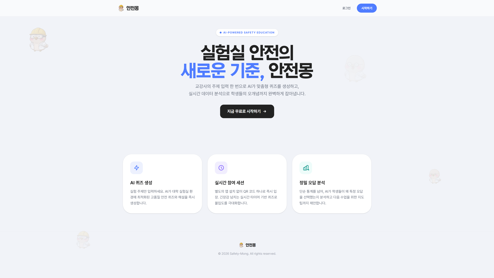 | 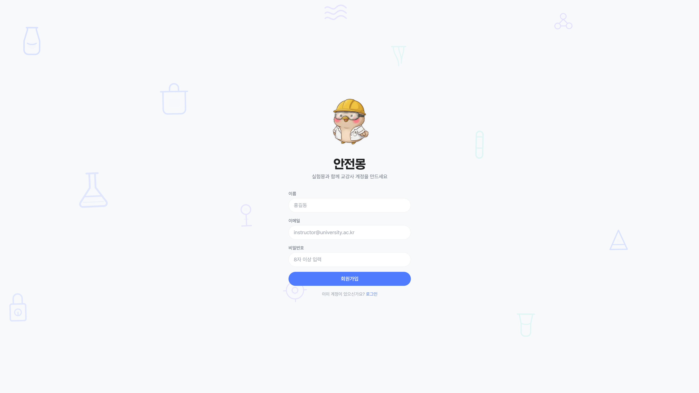 | 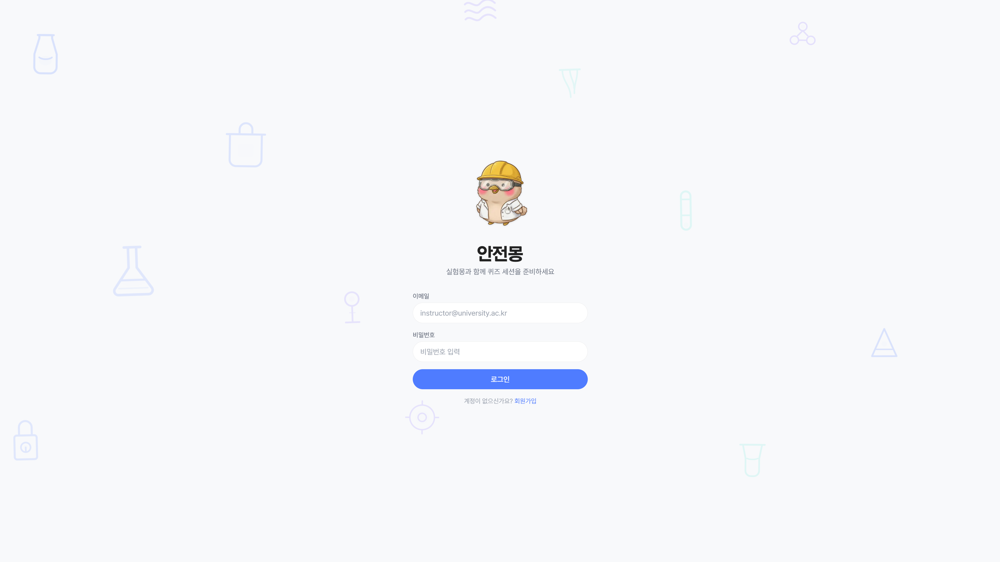 |

- 이메일과 비밀번호로 회원가입 후 로그인합니다.

### 2. AI 퀴즈 생성

| 생성 요청 | 생성 결과 | 검수 체크리스트 |
|:---:|:---:|:---:|
| 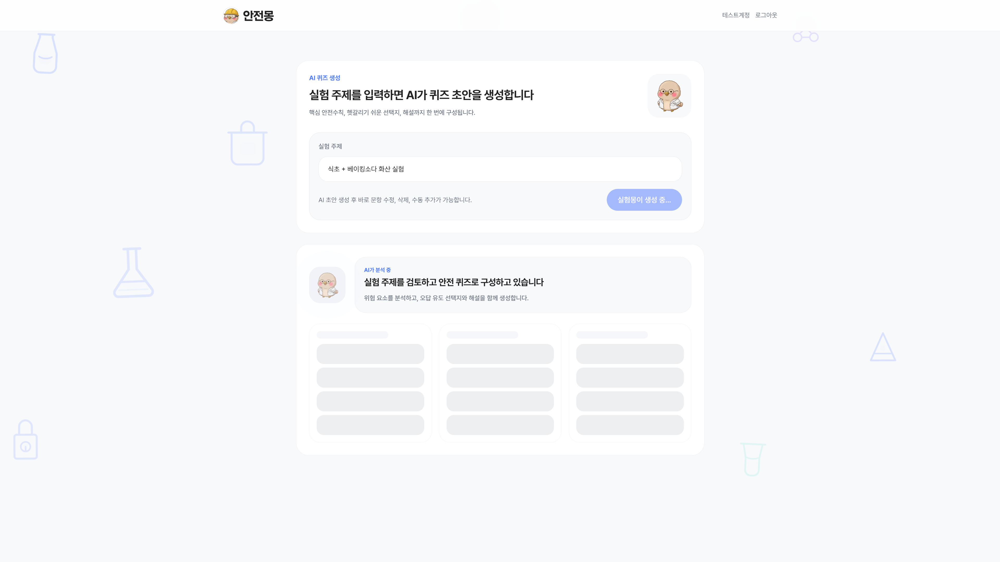 | 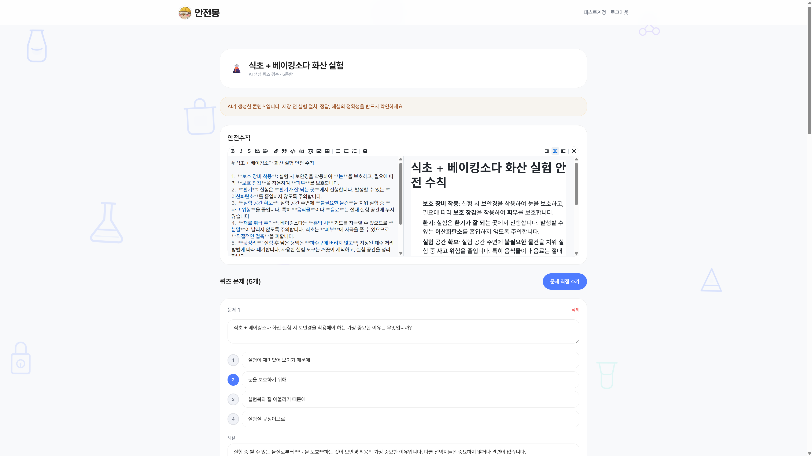 | 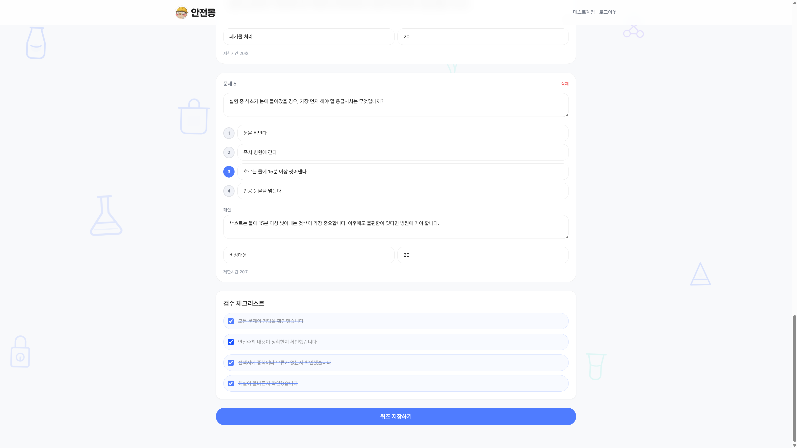 |

- 실험 주제와 안전수칙 내용을 입력합니다.
- AI가 주제에 맞는 안전 퀴즈를 자동 생성합니다.
- 체크리스트로 생성된 문제를 검수합니다.

### 3. 퀴즈 편집

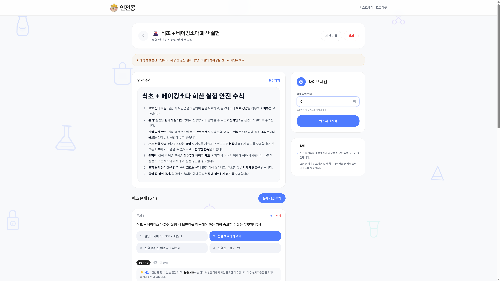

- 문제 수정·삭제·추가가 가능합니다.
- 안전수칙 내용도 편집할 수 있습니다.

### 4. 세션 생성

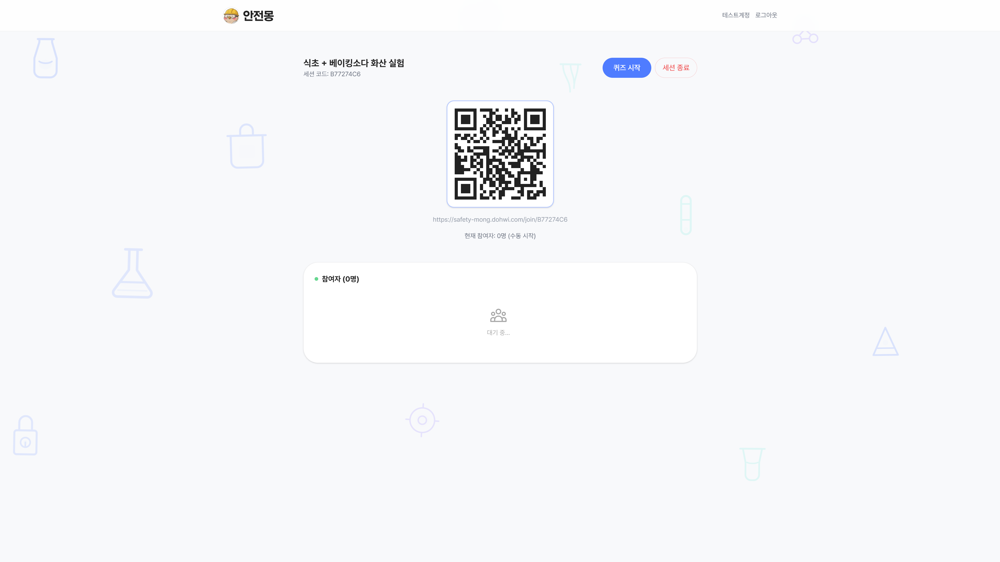

- 퀴즈함에서 새 세션을 생성합니다.
- 목표 참여자 수를 설정할 수 있습니다 (선택).

### 5. 실시간 대시보드

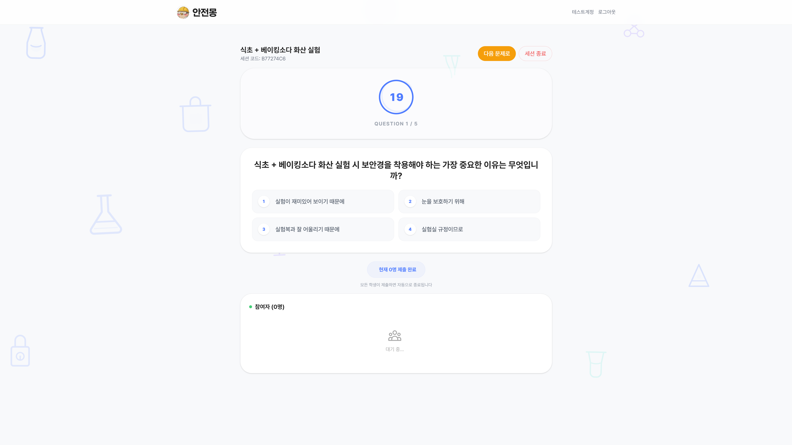

- QR 코드와 세션 코드로 학생을 초대합니다.
- 타이머, 참여자 목록, 응답 현황을 실시간으로 확인합니다.
- 모든 학생이 제출하면 자동으로 다음 문제로 넘어갑니다.

### 6. 분석 리포트

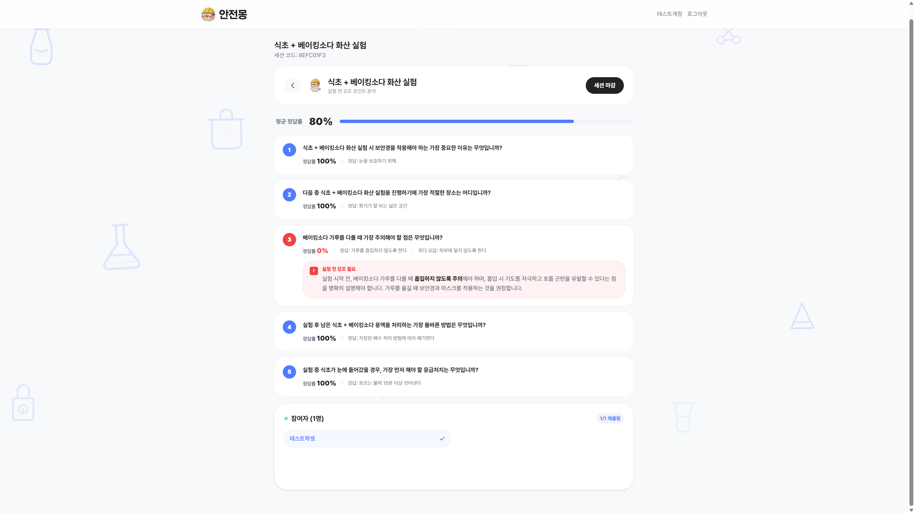

- 세션 종료 후 AI가 자동으로 오답 분석 리포트를 생성합니다.
- 문항별 정답률, 공통 오개념, 실험 전 강조 포인트를 확인합니다.

---

## 학생 워크플로우

### 1. 실시간 퀴즈

| 문제 풀이 | 정답 해설 | 오답 해설 |
|:---:|:---:|:---:|
| 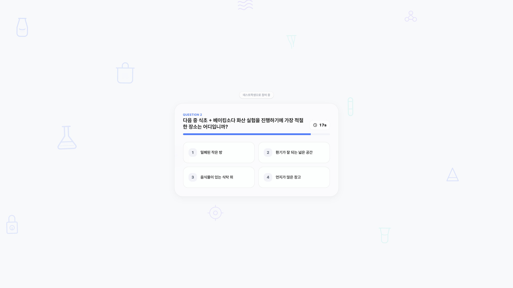 | 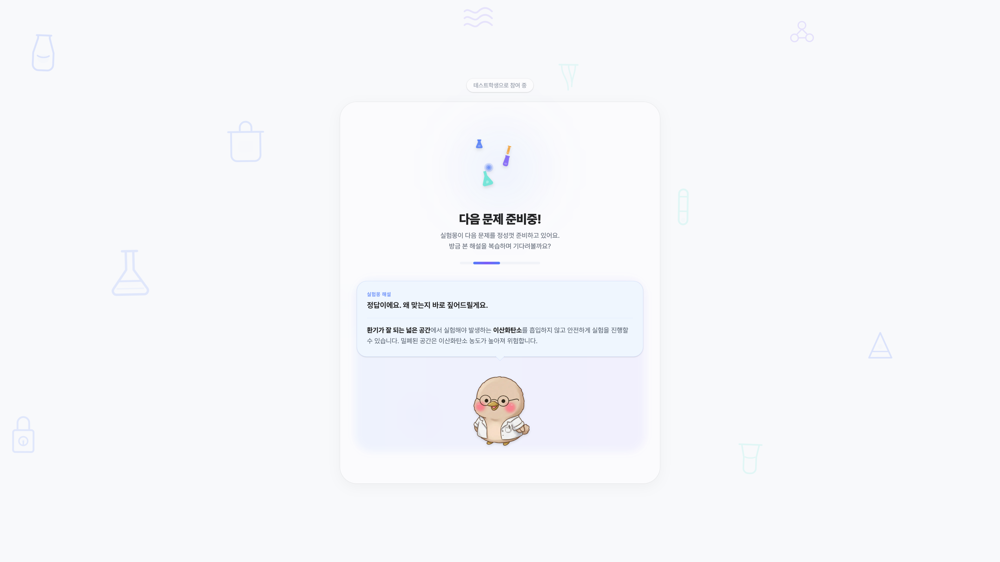 | 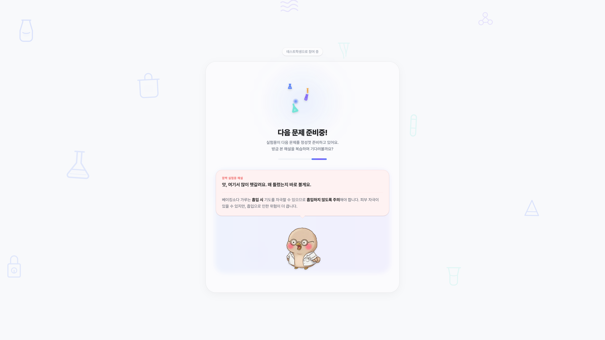 |

- 타이머 내에 정답을 선택합니다.
- 제출 후 즉시 정답/오답 여부와 해설을 확인합니다.

### 2. 결과 화면

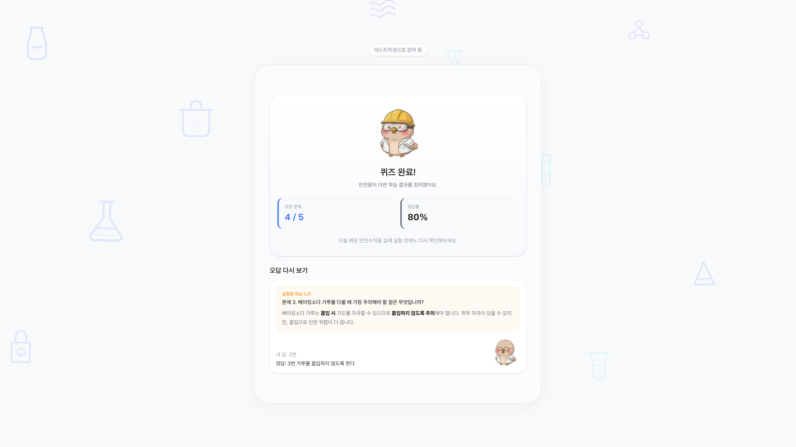

- 정답 수, 정답률을 확인합니다.
- 오답 문제의 해설을 다시 볼 수 있습니다.
